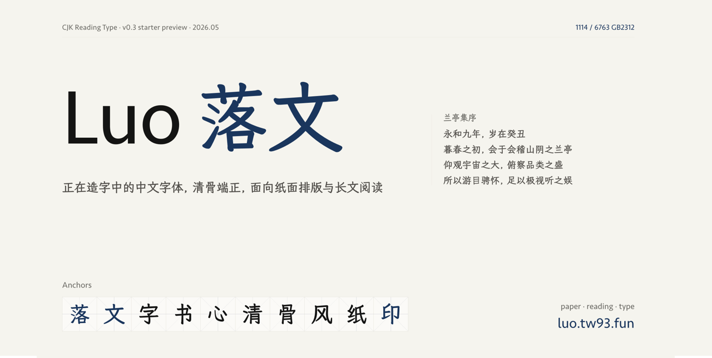

<p align="center">
  
</p>
<h1 align="center">Luo 落文</h1>
<p align="center">正在造字中的中文字体，面向纸面排版和长文阅读。</p>
<p align="center">
  <a href="https://luo.tw93.fun"></a>
  <a href="OFL.txt"></a>
  <a href="https://luo.tw93.fun/proof/gb2312.html"></a>
</p>

<p align="center">
  
</p>

## 这套字

Luo 落文是一套正在造字中的开源中文字体，面向文章、文档、封面和项目官网等纸面感场景，取法魏晋小楷式清骨，结合当代舒展楷意印刷字的开阔骨架，保持横轻竖重、端正含蓄、轮廓干净。

落文不做书法复刻，不追求手写感，也不靠古风装饰制造气质，希望在真实排版里安静、有秩序，读久了不腻。

关键词：有筋骨、纸面耐读、端正含蓄、现代可排版。

## 造字状态

落文目前是 v0.3 starter 预览版，已经覆盖官网、README、两页纸试读、内部打印样张和一组核心校准字，可以用来查看风格、试排页面和参与造字反馈，但还不是完整 GB2312，也不是全量中文字体。

v0.3 先把小范围字集做可信，让官网能看、样张能印、长文灰度稳定、核心字形语法成立，大范围扩字放到 v0.4 推进，先补 GB2312 一级常用字，再进入完整 GB2312 实验构建。

后续会继续扩字、校准部件、检查小字号灰度和打印效果，字形、覆盖范围、文件大小和构建方式都可能继续调整，正式使用前建议先看网页样张、纸面试读和常用字校准页。

## 预览

- 网页样张：[luo.tw93.fun](https://luo.tw93.fun)
- 本地样张：[index.html](index.html)
- GB2312 常用字校准：[proof/gb2312.html](proof/gb2312.html)
- 风格规范与批量改字提示：[STYLE.md](STYLE.md)

## 使用

仓库会提交当前 starter 构建产物，可以直接下载试用：

- [dist/Luo-Regular.otf](dist/Luo-Regular.otf)
- [dist/Luo-Regular.ttf](dist/Luo-Regular.ttf)
- [dist/Luo-Regular.woff2](dist/Luo-Regular.woff2)

网页里可以这样引入：

```css
@font-face {
  font-family: "Luo";
  src: url("https://cdn.jsdelivr.net/gh/tw93/Luo@main/dist/Luo-Regular.woff2") format("woff2");
  font-weight: 400;
  font-style: normal;
  font-display: swap;
  unicode-range: U+4E00-9FFF, U+3400-4DBF, U+3000-303F, U+FF00-FFEF;
}

body {
  font-family: "Luo", Seravek, Candara, Optima,
               "Iowan Old Style", Charter, Georgia,
               "Avenir Next", "Noto Sans CJK SC", sans-serif;
}
```

Luo Regular 只承担中文、中文标点和全角符号，英文和数字建议走 Seravek-first 的人文风格 fallback，避免过硬的几何无衬线或过强的古典衬线气质。

## 参与造字

落文还在扩字和校准中。想参与字形反馈、批量改字或本地构建，请先看 [CONTRIBUTING.md](CONTRIBUTING.md) 和 [STYLE.md](STYLE.md)。

## 授权与鸣谢

Luo 采用 [SIL Open Font License 1.1](https://openfontlicense.org) 授权，可以自由使用、分享、嵌入和改造，衍生字体也需要继续使用 SIL OFL 授权，落文基于 [LXGW WenKai Screen](https://github.com/lxgw/LxgwWenKai-Screen) 底层构建，向 LXGW / 落霞孤鹜和 Fontworks 的 Klee One 开源工作致谢，详细授权见 [OFL.txt](OFL.txt)。
